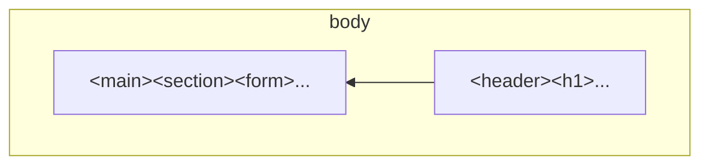
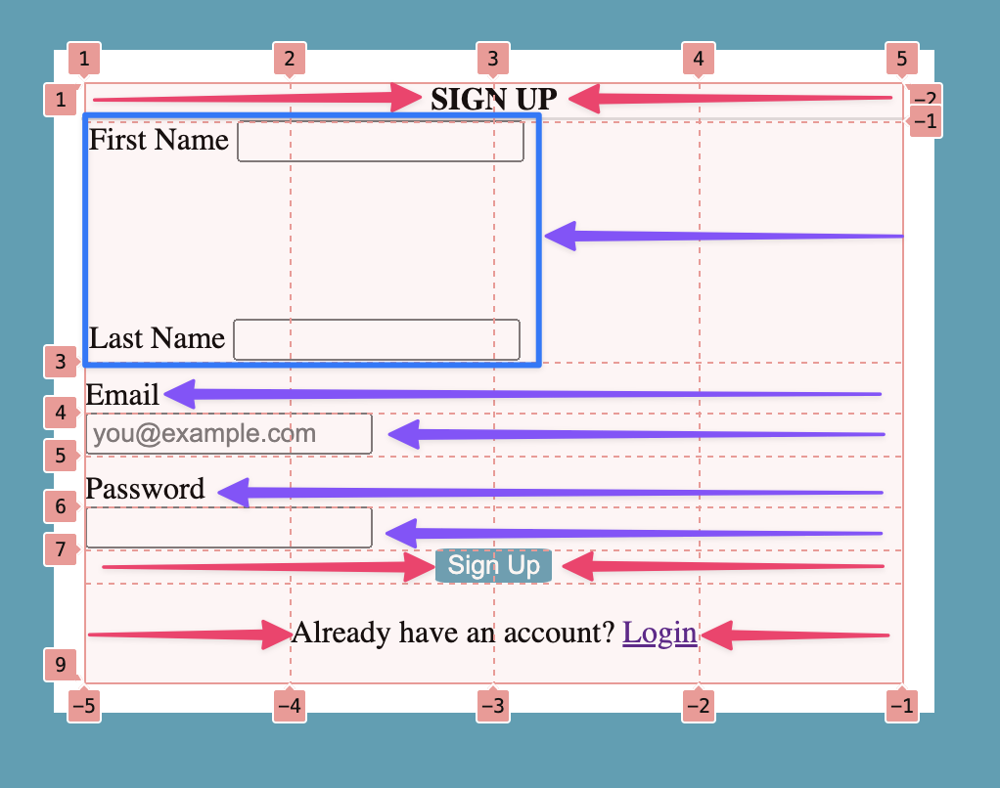

# Project HTML CSS - Form

## Lab Description

In this lab exercise we will create a sign-up form using HTML and CSS.  


The form is not connected to a backend to process sign-ups or logins.

## Demo

The demo website is live here

https://ebouchut-laplateforme.github.io/project-html-css-form/

It is published automatically each time we push the `main` branch.

## Layout

I use a mix of CSS Flexbox and grid layout:
- Flexbox to lay out:
    -  The topmost items from right to left (heading 1, and form)
    -  The first name and last name fields in the form from left to right
- Grid layout for the form

### 2-Column Layout using Flexbox

The `<body>` tag is a flex container (`display: flex;`) that lays its flex items (direct children) horizontally from right to left (`flex-direction: row-reverse;`).

- First, the `<header>` with a `<h1>` is displayed on the right
- Then, `<main>` that contains the `<form>` is displayed on the left



- [HTML](https://github.com/ebouchut-laplateforme/project-html-css-form/blob/de9aa0f95999fc959570fe675cc84a0cfab4aefc/index.html#L12-L21)
  ```html
  <body class="flex-container-body center">
  
      <header class="flex-item-body">
          <h1> <!-- ... --> </h1>
      </header>

    <main class="flex-item-body">
        <section>
            <form action="#" method="post" autocomplete="off" id="grid-container-form">
                <!-- ... -->
            </form>
          </section>
      </main>
  </body>
  ```
- [CSS](https://github.com/ebouchut-laplateforme/project-html-css-form/blob/de9aa0f95999fc959570fe675cc84a0cfab4aefc/css/styles.css#L76-L78)
  ```css
  .flex-container-body { /* body */
      display:        flex;
      flex-direction: row-reverse;
  }
  ```

The 2 flex item (`<header>`, `<main>`) take [a share of the available width](https://github.com/ebouchut-laplateforme/project-html-css-form/blob/de9aa0f95999fc959570fe675cc84a0cfab4aefc/css/styles.css#L84C4-L96):
- 30%: `<header>` (contains `<h1>`)  
  ```css
    .flex-item-body:first-child {
    /* header(h1) takes 30% of its container width (body),
     * minus half the width of the gutter around it
     */
    flex:            calc(30% - (var(--ex-container-items-gap) / 2));
  }
  ```
- 70%: `<main>`   (contains  `<form>`)
  ```css
  .flex-item-body:nth-child(2) {
    /* main(section > form) takes 70% of its container width (body),
     * minus half the width of the gutter around it
     */
    flex:            calc(70% - (var(--ex-container-items-gap) / 2));
  }
  ```

I use [nested CSS rules](https://developer.mozilla.org/en-US/docs/Web/CSS/CSS_nesting/Using_CSS_nesting) to target flex items within their container, improving readability by keeping related rules close together and in context. For a real word website, I should have also provided the corresponding non-nested CSS rules to take into account the 🦕-browsers, but I chose not to for this lab.

```css
.flex-container-body {
  display:         flex;
  /* The flex items are laid out from right to left (main(section > form) ← header(h1)  */
  flex-direction:  row-reverse;
  flex-wrap:       wrap;
  justify-items:   center; /* Center each flex item horizontally */
  align-items:     center; /* Center each flex item vertically */
  gap:             var(--ex-container-items-gap); /* Add a gutter between the flex items */

  .flex-item-body:first-child {
    /* header(h1) takes 30% of its container width (body),
     * minus half the width of the gutter around it
     */
    flex:            calc(30% - (var(--ex-container-items-gap) / 2));
  }

  .flex-item-body:nth-child(2) {
    /* main(section > form) takes 70% of its container width (body),
     * minus half the width of the gutter around it
     */
    flex:            calc(70% - (var(--ex-container-items-gap) / 2));
  }
}
```

### Grid Layout for the Form



- The form:
    - is laid out using a **CSS Grid** (`display: grid;`)
     - has **4 columns** with a proportional fraction of the total width available (`grid-template-columns: repeat(4, 1fr);`). This means that each column takes one fourth of the available width in the form.
    - **Grid items** (direct children of the container (form)) are **left aligned by default** (`justify-items: start;`) (see the purple left arrow in the grid snapshot above).

  ```css
  #grid-container-form {
    display:               grid;
    grid-template-columns: repeat(4, 1fr); /* 4 columns of equal size */
    grid-template-rows:    auto;
    justify-items:         start; /* By default grid items are left aligned */
  
    /* ... */
  }
  ````

- 3 grid items are centered (see the red arrows in the grid snapshot above):
    - The form title (`<legend>`
    - The `Sign Up` submit button/field
    - The paragraph with a login link

  ```css
  #grid-container-form {
    /* ... */

    & > * {
      /* By default grid items take the whole width of the form */
      grid-column:         1 / -1; /* 1 denotes the first and -1 the last column lines */
    }

    & > legend {           /* Form title */
      justify-self:        center;
      /* ... */
    }

    & > .signup {          /* Signup button */
      justify-self:        center;
      /* ... */*
    }

    & > .login   {         /* paragraph with a login link */
      justify-self:        center;
    }
  }
  ```
  FYI: The `&` notation denotes the container the CSS rule is nested within.  
  For instance, these nested CSS rules:
  ```css
  #grid-container-form {
    /* ... */

    & > legend {
      /* ... */
    }
  }
  ```
  are equivalent to their non-nested form:
  ```css
  #grid-container-form {
        /* ... */
  }

  #grid-container-form > legend {
     /* ... */
  }
  ```

### Flexbox Layout for the Full Name

I refer to the **first name** and **last name** form fields as the full name.
They should be displayed next to each other from left to right.
This is why I enclosed them in a `<fieldset class="full-name">` that acts as a flexbox container.


- [HTML](https://github.com/ebouchut-laplateforme/project-html-css-form/blob/de9aa0f95999fc959570fe675cc84a0cfab4aefc/index.html#L24-L33)
  I used 2 dreaded `<div>`s below the `<fieldset>` to act as flex items. First they have no semantic meaning and I have used before all the semantic tags available to me ;-)!
  ```html
  <main class="flex-item-body">
    <section>
      <form action="#" method="post" autocomplete="off" id="grid-container-form">
        <legend>Sign Up</legend>

        <fieldset class="full-name">
          <div>
            <label for="first-name" class=""first-name">First Name</label>
            <input type="text" id="first-name" name="first-name">
          </div>
          <div>
            <label for="last-name" class="last-name">Last Name</label>
            <input type="text" id="last-name" name="last-name">
          </div>
        </fieldset>

        <!-- ... -->
      </form>
    </section>
  </main>
  ```
- [CSS](https://github.com/ebouchut-laplateforme/project-html-css-form/blob/de9aa0f95999fc959570fe675cc84a0cfab4aefc/css/styles.css#L116-L118)
  ```css
  #grid-container-form {
    /* ... */

    & > .full-name {       /* fieldset is a flex container with first-name and last-name  */
      display:             flex;
      flex-direction:      flex-start;
      flex-wrap:           wrap;
      /* ... */
    }
  }
  ```
