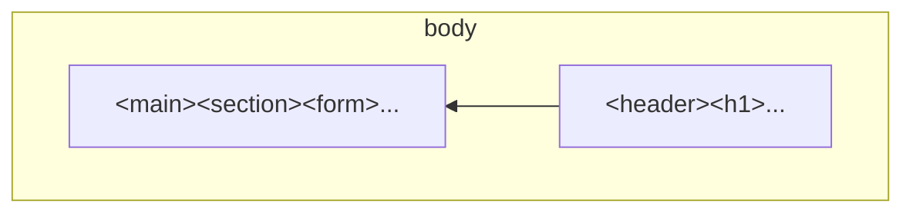

# Project HTML CSS - Form

## Lab Description

In this lab exercise we will create a sign-up form using HTML and CSS.  


The form is not connected to a backend to processes sign-ups.

## Demo

The demo website is live here

https://ebouchut-laplateforme.github.io/project-html-css-form/

It is published automatically each time we push to the `main` branch.

## Layout


### 2-Column Layout using Flexbox

The `<body>` tag is a flex container (`display: flex;`) that lays its flex items (direct children) horizontally from right to left (`flex-direction: row-reverse;`).

- First, the `<header>` with a `<h1>` is displayed on the right
- Then, `<main>` that contains the `<form>` is displayed on the left




```html
<body class="flex-container-body center">

    <header class="flex-item-body">
        <h1> <!-- ... --> </h1>
    </header>

    <main class="flex-item-body">
        <section>
            <form action="#" method="post" autocomplete="off" id="grid-container-form">
                <!-- ... -->
        </form>
        </section>
    </main>
</body>
```

```css
.flex-container-body { /* body */*
    display:        flex;
    flex-direction: row-reverse;
}
```
